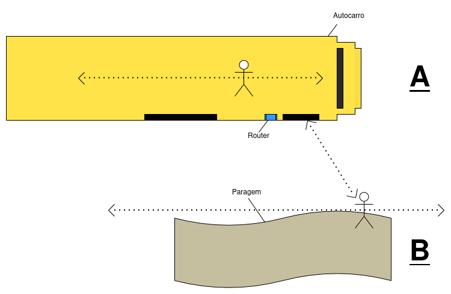

# inMotion

## Dataset Labels:
> A - Inside the Bus

> B - Outside the Bus

## Route Labels:
> LoopA - Inside of the bus

> LoopB - Outside of the bus

> AB - From inside to outside the bus

> BA - From outside to inside the bus

## Dataset Structure:

Each line represents a sequence of RSSI measurements captured every second over 10 seconds, associated with a MAC address and a label indicating the route taken.

---

### Dataset Example

| MAC Address         | 1   | 2   | 3   | 4   | 5   | 6   | 7   | 8   | 9   | 10  | Trajeto |
|----------------------|-----|-----|-----|-----|-----|-----|-----|-----|-----|-----|----------|
| e6:53:5c:2a:e8:e2 | -48.0 | -48.0 | -54.0 | -53.0 | -55.0 | -50.0 | -57.0 | -53.0 | -55.0 | -51.0 | LoopB |
| e6:53:5c:2a:e8:e2 | -41.0 | -31.0 | -31.0 | -35.0 | -40.0 | -48.0 | -45.0 | -48.0 | -54.0 | -56.0 | AB |


---

## SCHEMA:


## How to use the export.py script:
```sh
# takes as many groups as needed
 uv run export.py \                         
  --input wavecom_files/noiseG1BtoA_G2loopB.txt  \
  --output data/noiseBA_BB.csv \
  --group G1:ea:51:ae:7f:62:fa,76:64:61:f6:e6:14 \ # it can take N MACs
  --group G2:e6:53:5c:2a:e8:e2,04:b1:67:ac:8d:65 \ # it can take N MACs
  --group-label G1:BA \ # each group have a label
  --group-label G2:LoopB \ # each group have a label
```

### Arguments:
--input: Input wavecom data file
--output: Output CSV file
--group: Group definition in the form label:mac1,mac2,... (repeatable)
--group-label: Map group name to final label, e.g., G1:AB (repeatable)

## How to use the merge_csv.py script:
```bash
python merge_csv.py --input data/ --output dataset.csv
```


 uv run export.py \                         
  --input wavecom_files/noiseG1AtoB_G2BtoA2.txt \
  --output data/noiseAB_BA.csv \
  --group G1:2e:ad:62:53:35:66,76:64:61:f6:e6:14 \ # it can take N MACs
  --group G2:e6:53:5c:2a:e8:e2,04:b1:67:ac:8d:65 \ # it can take N MACs
  --group-label G1:AB \ # each group have a label
  --group-label G2:BA \ # each group have a label

 uv run export.py --input wavecom_files/noiseG1AtoB_G2BtoA2.txt --output data/noiseAB_BA2.csv --group G1:2e:ad:62:53:35:66,76:64:61:f6:e6:14 --group G2:e6:53:5c:2a:e8:e2,04:b1:67:ac:8d:65 --group-label G1:AB --group-label G2:BA